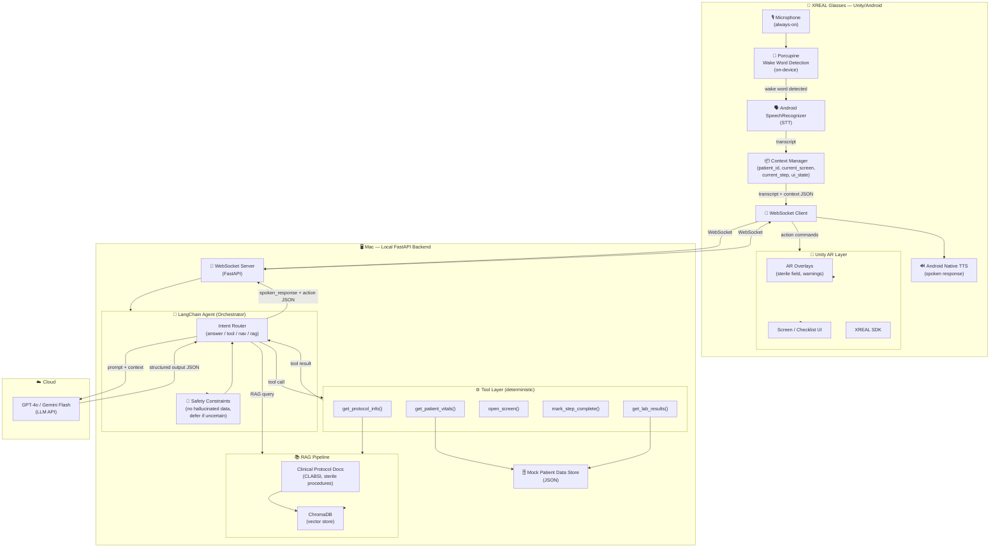

# GCI — AI System Design Document
**Project:** Multimodal Agentic AR Assistant for CLABSI Prevention  
**Platform:** XREAL Glasses (Unity/Android) + Local Mac AI Backend  
**Version:** 1.0 — March 2026  
**Status:** Active Reference

---

## Table of Contents

1. [System Philosophy](#1-system-philosophy)
2. [High-Level Architecture](#2-high-level-architecture)
3. [Architecture Diagram](#3-architecture-diagram)
4. [Tech Stack](#4-tech-stack)
5. [Component Deep-Dives](#5-component-deep-dives)
   - 5.1 [Input Layer — Wake Word + STT](#51-input-layer--wake-word--stt)
   - 5.2 [Context Manager](#52-context-manager)
   - 5.3 [WebSocket Communication Layer](#53-websocket-communication-layer)
   - 5.4 [FastAPI Backend](#54-fastapi-backend)
   - 5.5 [LangChain Orchestrator (AI Brain)](#55-langchain-orchestrator-ai-brain)
   - 5.6 [Tool Layer](#56-tool-layer)
   - 5.7 [RAG Pipeline](#57-rag-pipeline)
   - 5.8 [Safety Constraints Layer](#58-safety-constraints-layer)
   - 5.9 [Output Layer — TTS + AR](#59-output-layer--tts--ar)
6. [API Contracts & Schemas](#6-api-contracts--schemas)
7. [End-to-End Data Flows](#7-end-to-end-data-flows)
8. [Error Handling Strategy](#8-error-handling-strategy)
9. [Configuration & Environment](#9-configuration--environment)
10. [Development Setup](#10-development-setup)

---

## 1. System Philosophy

> **GCI is not a chatbot. It is an intent-driven, tool-augmented execution engine.**

The core distinction: a chatbot generates a response. GCI generates a **decision** — and that decision may be to speak, to navigate, to retrieve data, or to manipulate AR overlays. Every voice query routes through a structured decision model before any response is produced.

### Design Principles

| Principle | Implication |
|---|---|
| **Tool-first for real data** | Never hallucinate patient data; always call a tool |
| **Structured outputs** | Every LLM response is a typed JSON object, not free text |
| **Context-aware routing** | The AI always knows where the user is (screen, step, patient) |
| **Safety by constraint** | Hard rules enforced before any response is emitted |
| **Latency-conscious** | Every component chosen to minimize end-to-end round-trip |
| **Offline-resilient STT** | Wake word and STT run on-device; only AI reasoning hits the network |

---

## 2. High-Level Architecture

```
┌─────────────────────────────────────────────────────────┐
│                 XREAL Glasses (Android/Unity)            │
│                                                         │
│  🎙️ Mic → [Porcupine Wake Word] → [Android STT]         │
│                                    ↓                    │
│                           [Context Manager]              │
│                                    ↓                    │
│                        [WebSocket Client]  ←────────────┤
│                                    ↕         responses  │
│         [Unity AR Layer] ← action commands              │
│         [Android TTS]    ← spoken_response              │
└─────────────────┬───────────────────────────────────────┘
                  │ WebSocket (local Wi-Fi)
┌─────────────────▼───────────────────────────────────────┐
│               Mac Backend (FastAPI/Python)               │
│                                                         │
│         [WebSocket Server]                              │
│                ↓                                        │
│         [LangChain Agent]  ←──────────→  ☁️ GPT-4o      │
│          ├── Intent Router                   (Cloud LLM) │
│          ├── Safety Gate                                 │
│          ├── Tool Executor                              │
│          └── RAG Retriever → [ChromaDB]                 │
│                                                         │
│         [Mock Patient Data Store]                       │
└─────────────────────────────────────────────────────────┘
```

**Latency Budget (target: < 2s end-to-end)**

| Stage | Target |
|---|---|
| Porcupine wake word detection | ~20ms |
| Android SpeechRecognizer STT | ~300–600ms |
| WebSocket transit (local Wi-Fi) | ~5–15ms |
| LangChain routing + tool execution | ~50–150ms |
| GPT-4o / Gemini Flash API call | ~400–800ms |
| Android TTS output start | ~50ms |
| **Total** | **~850ms – 1.6s** |

---

## 3. Architecture Diagram

### Stack Summary

| Layer | Technology |
|---|---|
| Device | XREAL Glasses → Unity (Android) |
| Wake Word | Porcupine SDK (on-device, always-on) |
| STT | Android `SpeechRecognizer` (post wake word) |
| Communication | WebSocket (Unity ↔ Mac backend) |
| Backend | Python + FastAPI (local Mac) |
| AI Orchestration | LangChain + Tool Calling |
| LLM | Cloud API — GPT-4o or Gemini Flash |
| RAG | ChromaDB + LangChain retriever |
| Patient Data | Mocked JSON store |
| TTS | Android native TTS |
| AR Rendering | Unity + XREAL SDK |

### Component Diagram



### Example End-to-End Flow

```
User says "Hey GCI, what's the patient's heart rate?"
         │
[Porcupine — on-device]  ← wake word fires
         │
[Android SpeechRecognizer] → transcript: "what's the patient's heart rate"
         │
[Context Manager] injects: { patient_id, current_screen, step }
         │
[WebSocket] → Mac FastAPI
         │
[LangChain Agent]
  → Safety check ✓
  → Intent: retrieve_data
  → Tool: get_patient_vitals("123")
         │
[Mock DB] → { heart_rate: 96 }
         │
[LLM] generates: "The patient's heart rate is 96 bpm."
         │
[WebSocket] → Unity/Android
         │
[Android TTS] speaks response
[Unity] (no overlay needed for this query)
```

### Key Design Decisions

- **No Ollama** — local LLMs on Mac add 3–8s latency; cloud LLM is called from your Mac FastAPI, keeping costs low during dev while keeping accuracy high
- **WebSocket over REST** — persistent connection = no handshake overhead per message, critical for voice loops
- **Porcupine** — runs entirely on CPU, battery-efficient, no cloud dependency for wake word
- **ChromaDB** — runs embedded in your FastAPI process, no separate DB service needed on your Mac
- **Context stays on device** — Android holds the session state; only sends what the LLM needs per request, reducing data exposure

---

## 4. Tech Stack

### Device Layer

| Component | Technology | Why |
|---|---|---|
| App framework | Unity (C#) for Android | XREAL SDK is Unity-native |
| Wake word | **Porcupine** (Picovoice SDK) | On-device, ~20ms, battery-efficient, no audio leaves device until triggered |
| STT | **Android SpeechRecognizer** | Native, fastest option post-wake-word, no extra API cost |
| TTS | **Android native TTS** | Zero latency, no API call, works offline |
| AR rendering | XREAL SDK + Unity UI | Native XREAL integration |
| Backend comms | **WebSocket** | Persistent connection, real-time streaming, no TCP handshake per query |

### Backend Layer (Mac)

| Component | Technology | Why |
|---|---|---|
| Web framework | **FastAPI** (Python) | Async-native, WebSocket support, fast, great AI ecosystem |
| AI orchestration | **LangChain** | Best-in-class tool calling, RAG integration, agent loops |
| LLM | **GPT-4o or Gemini 1.5 Flash** | Sub-800ms, structured output (JSON mode), superior reasoning |
| Vector DB | **ChromaDB** | Embedded in process (no separate service), fast local retrieval |
| Data format | **JSON** throughout | Uniform, easy to debug, works across all languages |
| Patient data | **Mocked JSON store** | MVP scope; swap with FHIR API later |

> **Why cloud LLM and not local Ollama?**  
> Local LLMs on Mac (Llama 3, Mistral via Ollama) take 2–8 seconds per inference for a model capable of reliable tool calling. GPT-4o/Gemini Flash costs fractions of a cent per query and responds in under 800ms — an unambiguous win for a voice-based interaction model where every second matters.

---

## 5. Component Deep-Dives

### 5.1 Input Layer — Wake Word + STT

#### Wake Word: Porcupine

Porcupine runs a tiny trained model entirely on-device CPU. It listens for a custom wake phrase (e.g., "Hey GCI") without streaming audio to any server.

**Integration (Unity/Android):**
```csharp
// Unity C# — Porcupine initialization
PorcupineManager _porcupineManager = await PorcupineManager.FromBuiltInKeywords(
    accessKey: "PICOVOICE_ACCESS_KEY",
    keywords: new[] { BuiltInKeyword.HEY_GOOGLE }, // or custom keyword
    wakeWordCallback: OnWakeWordDetected
);

void OnWakeWordDetected() {
    // Stop Porcupine, start Android STT
    _porcupineManager.Stop();
    StartSTT();
}
```

**Key settings:**
- `sensitivity`: 0.5 (balance false positives vs. misses — tune for clinical noise)
- Always re-arm Porcupine after STT result is received

#### STT: Android SpeechRecognizer

Fires after Porcupine detects wake word. Captures one utterance then stops.

**Integration (Unity/Android):**
```csharp
// AndroidJavaObject bridge to SpeechRecognizer
public void StartSTT() {
    AndroidJavaClass unityPlayer = new AndroidJavaClass("com.unity3d.player.UnityPlayer");
    AndroidJavaObject activity = unityPlayer.GetStatic<AndroidJavaObject>("currentActivity");
    activity.Call("startSpeechRecognition"); // calls Android Kotlin layer
}
```

**Android Kotlin side:**
```kotlin
fun startSpeechRecognition() {
    val intent = Intent(RecognizerIntent.ACTION_RECOGNIZE_SPEECH).apply {
        putExtra(RecognizerIntent.EXTRA_LANGUAGE_MODEL, RecognizerIntent.LANGUAGE_MODEL_FREE_FORM)
        putExtra(RecognizerIntent.EXTRA_MAX_RESULTS, 1)
        putExtra(RecognizerIntent.EXTRA_PARTIAL_RESULTS, false)
    }
    speechRecognizer.startListening(intent)
}

// On result: send transcript to Unity
override fun onResults(results: Bundle?) {
    val transcript = results?.getStringArrayList(SpeechRecognizer.RESULTS_RECOGNITION)?.get(0)
    UnityPlayer.UnitySendMessage("AIManager", "OnTranscriptReceived", transcript)
    // Re-arm Porcupine
    porcupineManager.start()
}
```

---

### 5.2 Context Manager

The Context Manager lives in the Android/Unity app layer. It is the **single source of truth** for what state the app is in at any given moment. It is injected into every message sent to the backend.

#### Context Schema

```json
{
  "patient_id": "string | null",
  "current_screen": "string",
  "current_step": "integer | null",
  "procedure_active": "boolean",
  "active_overlays": ["string"],
  "recent_actions": ["string"],
  "session_id": "string"
}
```

#### Context Fields

| Field | Type | Description |
|---|---|---|
| `patient_id` | string | Active patient. `null` if no patient loaded |
| `current_screen` | string | Current Unity screen name (e.g., `"central_line_checklist"`) |
| `current_step` | int | Current step index in active procedure. `null` if no procedure |
| `procedure_active` | bool | Whether a clinical procedure is currently in progress |
| `active_overlays` | string[] | IDs of AR overlays currently rendered |
| `recent_actions` | string[] | Last 3 actions taken (for conversational continuity) |
| `session_id` | string | UUID for this session (for logging) |

#### Context Update Rules

- Updated **synchronously** by Unity whenever screen changes or step changes
- Injected into **every** WebSocket message before sending
- Never persisted to backend (stays on device)
- `recent_actions` is a rolling buffer, max size 3

---

### 5.3 WebSocket Communication Layer

WebSocket provides a persistent, bidirectional, low-latency channel between Unity/Android and the Mac backend.

#### Connection Lifecycle

```
1. App launch → WebSocket.Connect(ws://192.168.x.x:8000/ws)
2. Connection established → send handshake { type: "hello", session_id: "..." }
3. Per voice query → send AIRequest message
4. Backend streams or sends AIResponse message
5. App disconnect on pause/close → WebSocket.Close()
6. Auto-reconnect on network drop (exponential backoff, max 5 retries)
```

#### Message Envelope

All messages are JSON with a `type` discriminator field:

```json
{
  "type": "ai_request | ai_response | action_ack | error | ping | pong",
  "session_id": "uuid",
  "timestamp": "ISO8601",
  "payload": { ... }
}
```

#### Unity WebSocket (C#)

```csharp
public class AIManager : MonoBehaviour {
    private WebSocket _ws;
    private ContextManager _ctx;

    async void Start() {
        _ws = new WebSocket("ws://192.168.1.100:8000/ws");
        _ws.OnMessage += OnMessageReceived;
        await _ws.Connect();
    }

    public async void SendQuery(string transcript) {
        var request = new AIRequest {
            type = "ai_request",
            session_id = _ctx.sessionId,
            timestamp = DateTime.UtcNow.ToString("o"),
            payload = new AIRequestPayload {
                transcript = transcript,
                context = _ctx.GetCurrentContext()
            }
        };
        await _ws.SendText(JsonUtility.ToJson(request));
    }

    void OnMessageReceived(string rawJson) {
        var msg = JsonUtility.FromJson<AIResponse>(rawJson);
        if (msg.payload.spoken_response != null)
            TTSManager.Speak(msg.payload.spoken_response);
        if (msg.payload.action != null)
            ActionExecutor.Execute(msg.payload.action);
    }
}
```

---

### 5.4 FastAPI Backend

The backend is a Python FastAPI application running locally on the developer's Mac. It exposes a single WebSocket endpoint and internal HTTP tool endpoints (called internally by LangChain, not by the device).

#### Directory Structure

```
backend/
├── main.py                  # FastAPI app, WebSocket endpoint
├── orchestrator.py          # LangChain agent setup
├── tools/
│   ├── __init__.py
│   ├── patient_tools.py     # get_patient_vitals, get_lab_results
│   ├── ui_tools.py          # open_screen, highlight_overlay
│   └── procedure_tools.py  # get_current_step, mark_step_complete
├── rag/
│   ├── __init__.py
│   ├── pipeline.py          # ChromaDB retriever setup
│   └── ingest.py            # Document ingestion script
├── data/
│   └── mock_patients.json   # Mocked patient data store
├── docs/                    # Clinical protocol PDFs/text files
├── config.py                # All config + env vars
└── requirements.txt
```

#### WebSocket Endpoint

```python
# main.py
from fastapi import FastAPI, WebSocket, WebSocketDisconnect
from orchestrator import run_agent
import json, uuid

app = FastAPI()

@app.websocket("/ws")
async def websocket_endpoint(websocket: WebSocket):
    await websocket.accept()
    try:
        while True:
            raw = await websocket.receive_text()
            message = json.loads(raw)

            if message["type"] == "ai_request":
                payload = message["payload"]
                response = await run_agent(
                    transcript=payload["transcript"],
                    context=payload["context"]
                )
                await websocket.send_text(json.dumps({
                    "type": "ai_response",
                    "session_id": message["session_id"],
                    "timestamp": datetime.utcnow().isoformat(),
                    "payload": response
                }))

            elif message["type"] == "ping":
                await websocket.send_text(json.dumps({"type": "pong"}))

    except WebSocketDisconnect:
        print(f"Client disconnected: {message.get('session_id', 'unknown')}")
```

---

### 5.5 LangChain Orchestrator (AI Brain)

The orchestrator is the core of the system. It takes a transcript + context and produces a structured `AIResponsePayload`.

#### Agent Architecture

The agent uses **OpenAI Function Calling** (via LangChain) — the LLM is given a set of tool definitions and decides which (if any) to call before producing a final response. This is more reliable than ReAct-style prompting for structured output.

```
Input: { transcript, context }
   ↓
Safety Pre-Check (hard rules)
   ↓
Prompt Construction (system prompt + context injection)
   ↓
LLM Call (GPT-4o with function definitions)
   ↓
   ├── If tool_call → execute tool → inject result → LLM Call (round 2)
   └── If direct response → finalize
   ↓
Output Schema Validation
   ↓
AIResponsePayload
```

#### System Prompt

```
You are GCI, an AI clinical assistant for CLABSI prevention procedures.
You run on XREAL glasses worn by nurses and clinicians.

## Your Role
You are an execution engine, not a chatbot. Every response must:
1. Be concise (1–2 sentences for spoken responses)
2. Use tools for any real data — never guess or fabricate
3. Produce structured JSON output in the exact schema provided
4. Defer to clinical judgment if uncertain

## Current Context
{context_json}

## Hard Rules (never violate)
- NEVER state patient data you did not retrieve from a tool
- NEVER make clinical recommendations or diagnoses
- NEVER proceed if patient_id is null and the query requires patient data
- ALWAYS use tool results verbatim for patient data
- If you cannot confidently determine intent, set intent to "clarify"

## Output Format
You must always respond in this exact JSON structure:
{
  "intent": "answer | retrieve_data | navigate | overlay | procedure | rag | clarify",
  "spoken_response": "The concise spoken response to the user.",
  "action": null | { "type": "...", "params": {...} }
}
```

#### Orchestrator Code

```python
# orchestrator.py
from langchain_openai import ChatOpenAI
from langchain.agents import AgentExecutor, create_openai_functions_agent
from langchain.prompts import ChatPromptTemplate, MessagesPlaceholder
from tools import ALL_TOOLS
from safety import safety_check
import json

llm = ChatOpenAI(model="gpt-4o", temperature=0, response_format={"type": "json_object"})

SYSTEM_PROMPT = """..."""  # Full system prompt as above

prompt = ChatPromptTemplate.from_messages([
    ("system", SYSTEM_PROMPT),
    MessagesPlaceholder("agent_scratchpad"),
    ("human", "{input}")
])

agent = create_openai_functions_agent(llm, ALL_TOOLS, prompt)
agent_executor = AgentExecutor(agent=agent, tools=ALL_TOOLS, verbose=True)

async def run_agent(transcript: str, context: dict) -> dict:
    # Safety pre-check
    violation = safety_check(transcript, context)
    if violation:
        return {
            "intent": "safety_block",
            "spoken_response": violation,
            "action": None
        }

    context_str = json.dumps(context, indent=2)
    user_input = f"User said: \"{transcript}\"\n\nCurrent context:\n{context_str}"

    result = await agent_executor.ainvoke({"input": user_input})
    
    # Parse and validate structured output
    output = json.loads(result["output"])
    return validate_response(output)
```

---

### 5.6 Tool Layer

Tools are **deterministic Python functions** registered with LangChain. The LLM decides which tool to call, but the function executes locally on the Mac with mock data.

#### Tool Catalog

##### `get_patient_vitals`

```python
@tool
def get_patient_vitals(patient_id: str) -> dict:
    """
    Retrieve current vital signs for a patient.
    Returns heart rate, blood pressure, SpO2, temperature, respiratory rate.
    Use this whenever the user asks about patient vitals or status.
    """
    patient = mock_db.get(patient_id)
    if not patient:
        return {"error": f"Patient {patient_id} not found"}
    return {
        "patient_id": patient_id,
        "heart_rate": patient["vitals"]["heart_rate"],
        "blood_pressure": patient["vitals"]["blood_pressure"],
        "spo2": patient["vitals"]["spo2"],
        "temperature": patient["vitals"]["temperature"],
        "respiratory_rate": patient["vitals"]["respiratory_rate"],
        "timestamp": patient["vitals"]["last_updated"]
    }
```

##### `get_lab_results`

```python
@tool
def get_lab_results(patient_id: str) -> dict:
    """
    Retrieve the most recent lab results for a patient.
    Returns CBC, CMP, blood cultures, and other recent panels.
    Use when the user asks about labs, cultures, or bloodwork.
    """
    patient = mock_db.get(patient_id)
    if not patient:
        return {"error": f"Patient {patient_id} not found"}
    return patient["latest_labs"]
```

##### `open_screen`

```python
@tool
def open_screen(screen_name: str) -> dict:
    """
    Navigate the Unity AR interface to a different screen.
    Valid screens: home, central_line_checklist, patient_overview,
                   sterile_prep, maintenance_protocol, settings
    Use when the user asks to open, go to, or show a specific screen.
    """
    VALID_SCREENS = [
        "home", "central_line_checklist", "patient_overview",
        "sterile_prep", "maintenance_protocol", "settings"
    ]
    if screen_name not in VALID_SCREENS:
        return {"error": f"Unknown screen: {screen_name}"}
    return {
        "action_type": "open_screen",
        "screen": screen_name,
        "status": "success"
    }
```

##### `highlight_overlay`

```python
@tool
def highlight_overlay(overlay_id: str, color: str = "yellow") -> dict:
    """
    Highlight a specific AR overlay element in the user's field of view.
    Valid overlays: sterile_field, catheter_site, hand_hygiene_reminder,
                    ppe_checklist, insertion_zone
    Use when user asks to focus on or highlight a specific area.
    """
    return {
        "action_type": "highlight_overlay",
        "overlay_id": overlay_id,
        "color": color,
        "status": "success"
    }
```

##### `mark_step_complete`

```python
@tool
def mark_step_complete(step_id: int) -> dict:
    """
    Mark a procedure step as complete in the current checklist.
    Use when user says they've completed a step or asks to check it off.
    step_id is 0-indexed.
    """
    return {
        "action_type": "mark_step_complete",
        "step_id": step_id,
        "status": "success"
    }
```

##### `get_current_step`

```python
@tool
def get_current_step() -> dict:
    """
    Get the current procedure step from the active checklist.
    Use when user asks what step they're on or what to do next.
    Note: current step is also in context, but use this tool to get
    the full step description and sub-tasks.
    """
    # In production: pull from context; for now returns mock
    return {
        "step_index": 3,
        "title": "Apply sterile drape",
        "description": "Place full-body sterile drape over patient, expose only insertion site.",
        "sub_tasks": ["Confirm site is cleaned", "Align drape fenestration", "Secure edges"],
        "warnings": ["Do not touch non-sterile surfaces after gloving"]
    }
```

##### `query_protocol`

```python
@tool
def query_protocol(query: str) -> dict:
    """
    Search clinical protocol documents for information.
    Use when the user asks protocol questions, best practices, or procedure details
    that aren't answered by other tools. Queries ChromaDB RAG pipeline.
    """
    from rag.pipeline import retriever
    docs = retriever.get_relevant_documents(query)
    return {
        "query": query,
        "results": [{"content": d.page_content, "source": d.metadata.get("source")} for d in docs[:3]]
    }
```

#### Tool Registration

```python
# tools/__init__.py
from .patient_tools import get_patient_vitals, get_lab_results
from .ui_tools import open_screen, highlight_overlay
from .procedure_tools import mark_step_complete, get_current_step, query_protocol

ALL_TOOLS = [
    get_patient_vitals,
    get_lab_results,
    open_screen,
    highlight_overlay,
    mark_step_complete,
    get_current_step,
    query_protocol
]
```

---

### 5.7 RAG Pipeline

The RAG pipeline retrieves relevant clinical protocol content when the LLM calls `query_protocol`.

#### Architecture

```
Clinical Docs (PDF/TXT)
        ↓
[Document Loader] (LangChain)
        ↓
[Text Splitter] (chunk_size=500, overlap=50)
        ↓
[Embedding Model] (OpenAI text-embedding-3-small or local)
        ↓
[ChromaDB] (persistent, local)
        ↓
At query time → similarity search → top-k chunks → return to agent
```

#### Setup & Ingestion

```python
# rag/ingest.py — run once to populate ChromaDB
from langchain_community.document_loaders import DirectoryLoader, PyPDFLoader
from langchain.text_splitter import RecursiveCharacterTextSplitter
from langchain_openai import OpenAIEmbeddings
from langchain_community.vectorstores import Chroma

def ingest_docs():
    loader = DirectoryLoader("./docs", glob="**/*.pdf", loader_cls=PyPDFLoader)
    documents = loader.load()

    splitter = RecursiveCharacterTextSplitter(chunk_size=500, chunk_overlap=50)
    chunks = splitter.split_documents(documents)

    embeddings = OpenAIEmbeddings(model="text-embedding-3-small")
    
    vectorstore = Chroma.from_documents(
        documents=chunks,
        embedding=embeddings,
        persist_directory="./chroma_db"
    )
    print(f"Ingested {len(chunks)} chunks from {len(documents)} documents.")

if __name__ == "__main__":
    ingest_docs()
```

#### Retriever

```python
# rag/pipeline.py
from langchain_community.vectorstores import Chroma
from langchain_openai import OpenAIEmbeddings

embeddings = OpenAIEmbeddings(model="text-embedding-3-small")

vectorstore = Chroma(
    persist_directory="./chroma_db",
    embedding_function=embeddings
)

retriever = vectorstore.as_retriever(
    search_type="similarity",
    search_kwargs={"k": 3}
)
```

#### Document Sources (place in `/backend/docs/`)

| Document | Content |
|---|---|
| `clabsi_prevention_bundle.pdf` | CDC CLABSI prevention bundle guidelines |
| `central_line_insertion_protocol.pdf` | Step-by-step insertion checklist |
| `sterile_technique_guide.pdf` | Sterile field setup and maintenance |
| `ppe_requirements.pdf` | Required PPE per procedure type |
| `hand_hygiene_protocol.pdf` | WHO hand hygiene guidelines |

---

### 5.8 Safety Constraints Layer

The safety layer is a **hard pre-filter** that runs before the LLM is ever called. It immediately returns a safe refusal if any rule is violated.

```python
# safety.py
SAFETY_RULES = [
    {
        "id": "no_patient_data_without_id",
        "check": lambda transcript, ctx: (
            ctx.get("patient_id") is None and
            any(kw in transcript.lower() for kw in ["patient", "vitals", "heart rate", "labs", "blood"])
        ),
        "response": "I don't have an active patient loaded. Please select a patient first."
    },
    {
        "id": "no_diagnosis",
        "check": lambda transcript, ctx: any(
            kw in transcript.lower() for kw in ["diagnose", "diagnosis", "what disease", "what condition", "is it"]
        ),
        "response": "I can't make clinical diagnoses. Please consult the attending physician."
    },
    {
        "id": "no_medication_dosing",
        "check": lambda transcript, ctx: any(
            kw in transcript.lower() for kw in ["dose", "dosage", "how much medication", "prescribe"]
        ),
        "response": "Medication dosing requires physician authorization. I can show you the protocol, but I can't advise dosing."
    }
]

def safety_check(transcript: str, context: dict) -> str | None:
    """Returns a safety message if a rule is violated, else None."""
    for rule in SAFETY_RULES:
        if rule["check"](transcript, context):
            return rule["response"]
    return None
```

#### Safety Rule Summary

| Rule | Trigger | Response |
|---|---|---|
| No patient data without ID | Patient query + no `patient_id` in context | "Please select a patient first" |
| No diagnosis | Words: diagnose, diagnosis, what disease | Defer to physician |
| No medication dosing | Words: dose, dosage, prescribe | Defer to physician |
| No fabrication | LLM output validator — rejects responses without tool grounding for patient data | Override with error response |
| Clarify if uncertain | LLM sets intent to `"clarify"` | Pass through to TTS |

---

### 5.9 Output Layer — TTS + AR

#### Response Flow

```
AIResponsePayload
     │
     ├── spoken_response → Android TTS
     │                     TextToSpeech.speak(spoken_response, QUEUE_FLUSH, null)
     │
     └── action → Unity ActionExecutor
                  switch(action.type):
                    "open_screen"       → SceneManager.LoadScene(screen)
                    "highlight_overlay" → AROverlayManager.Highlight(overlay_id, color)
                    "mark_step_complete"→ ChecklistManager.MarkComplete(step_id)
                    null                → no-op
```

#### Unity ActionExecutor

```csharp
// ActionExecutor.cs
public static class ActionExecutor {
    public static void Execute(ActionPayload action) {
        switch (action.type) {
            case "open_screen":
                SceneManager.LoadScene(action.@params["screen"]);
                break;
            case "highlight_overlay":
                AROverlayManager.Instance.Highlight(
                    action.@params["overlay_id"],
                    action.@params.GetValueOrDefault("color", "yellow")
                );
                break;
            case "mark_step_complete":
                ChecklistManager.Instance.MarkComplete(
                    int.Parse(action.@params["step_id"])
                );
                break;
            default:
                Debug.LogWarning($"Unknown action type: {action.type}");
                break;
        }
    }
}
```

#### TTS Configuration

```kotlin
// TTSManager.kt (Android)
class TTSManager(context: Context) : TextToSpeech.OnInitListener {
    private val tts = TextToSpeech(context, this)

    override fun onInit(status: Int) {
        if (status == TextToSpeech.SUCCESS) {
            tts.language = Locale.US
            tts.setSpeechRate(1.1f)  // Slightly faster for clinical efficiency
            tts.setPitch(1.0f)
        }
    }

    fun speak(text: String) {
        tts.speak(text, TextToSpeech.QUEUE_FLUSH, null, "gci_utterance")
    }
}
```

---

## 6. API Contracts & Schemas

### 6.1 AIRequest (Device → Backend)

```json
{
  "type": "ai_request",
  "session_id": "550e8400-e29b-41d4-a716-446655440000",
  "timestamp": "2026-03-19T21:00:00.000Z",
  "payload": {
    "transcript": "What's the patient's heart rate?",
    "context": {
      "patient_id": "PAT-123",
      "current_screen": "patient_overview",
      "current_step": null,
      "procedure_active": false,
      "active_overlays": [],
      "recent_actions": ["open_screen:patient_overview"],
      "session_id": "550e8400-e29b-41d4-a716-446655440000"
    }
  }
}
```

### 6.2 AIResponse (Backend → Device)

```json
{
  "type": "ai_response",
  "session_id": "550e8400-e29b-41d4-a716-446655440000",
  "timestamp": "2026-03-19T21:00:01.200Z",
  "payload": {
    "intent": "retrieve_data",
    "spoken_response": "The patient's heart rate is 96 beats per minute.",
    "action": null,
    "debug": {
      "tool_called": "get_patient_vitals",
      "tool_input": {"patient_id": "PAT-123"},
      "latency_ms": 1180
    }
  }
}
```

### 6.3 Intent Types

| Intent | Meaning | Action Expected |
|---|---|---|
| `answer` | Answered directly from context/knowledge | `action: null` |
| `retrieve_data` | Called a patient data tool | `action: null` (data in spoken_response) |
| `navigate` | Navigate to a new screen | `action: { type: "open_screen", ... }` |
| `overlay` | Manipulate an AR overlay | `action: { type: "highlight_overlay", ... }` |
| `procedure` | Procedure step action | `action: { type: "mark_step_complete", ... }` |
| `rag` | Response from protocol docs | `action: null` |
| `clarify` | LLM couldn't confidently determine intent | `action: null`, ask user to rephrase |
| `safety_block` | Safety rule violated | `action: null`, refusal message |

### 6.4 Action Schemas

**open_screen**
```json
{
  "type": "open_screen",
  "params": {
    "screen": "central_line_checklist"
  }
}
```

**highlight_overlay**
```json
{
  "type": "highlight_overlay",
  "params": {
    "overlay_id": "sterile_field",
    "color": "yellow"
  }
}
```

**mark_step_complete**
```json
{
  "type": "mark_step_complete",
  "params": {
    "step_id": "3"
  }
}
```

### 6.5 Mock Patient Data Schema

```json
{
  "PAT-123": {
    "name": "Jane Doe",
    "dob": "1965-04-12",
    "mrn": "PAT-123",
    "room": "ICU-4B",
    "admission_date": "2026-03-15",
    "vitals": {
      "heart_rate": 96,
      "blood_pressure": "118/76",
      "spo2": 98,
      "temperature": 98.6,
      "respiratory_rate": 16,
      "last_updated": "2026-03-19T20:45:00Z"
    },
    "latest_labs": {
      "wbc": 11.2,
      "hemoglobin": 10.8,
      "platelets": 145,
      "creatinine": 0.9,
      "blood_cultures": "pending",
      "collected_at": "2026-03-19T18:00:00Z"
    },
    "central_line": {
      "present": true,
      "insertion_date": "2026-03-16",
      "site": "right_subclavian",
      "days_in": 3
    }
  }
}
```

---

## 7. End-to-End Data Flows

### Flow A — Patient Data Query

```
User: "Hey GCI, what's the patient's heart rate?"
│
├─ [Porcupine] detects "Hey GCI" → arms STT
├─ [Android STT] → transcript: "what's the patient's heart rate"
├─ [Context Manager] injects context (patient_id: "PAT-123")
├─ [WebSocket] → AIRequest to Mac backend
│
├─ [Safety Check] → patient_id present ✓, no diagnosis keywords ✓ → PASS
├─ [LangChain Agent] → LLM decides: tool_call = get_patient_vitals("PAT-123")
├─ [Tool] → mock_db lookup → { heart_rate: 96, ... }
├─ [LangChain Agent] → LLM final response:
│     { intent: "retrieve_data", spoken_response: "The patient's heart rate is 96 bpm.", action: null }
│
├─ [WebSocket] → AIResponse to Unity/Android
├─ [Android TTS] → speaks "The patient's heart rate is 96 beats per minute."
└─ [Unity] → no action (action: null)
```

### Flow B — Navigation Command

```
User: "Hey GCI, open the central line checklist"
│
├─ [STT] → "open the central line checklist"
├─ [Safety Check] → PASS
├─ [LangChain Agent] → tool_call = open_screen("central_line_checklist")
├─ [Tool] → returns { action_type: "open_screen", screen: "central_line_checklist" }
├─ [LLM] → { intent: "navigate", spoken_response: "Opening the central line checklist.", action: { type: "open_screen", params: { screen: "central_line_checklist" } } }
│
├─ [Android TTS] → "Opening the central line checklist."
└─ [Unity ActionExecutor] → SceneManager.LoadScene("central_line_checklist")
```

### Flow C — Protocol Question (RAG)

```
User: "Hey GCI, what are the sterile precautions for insertion?"
│
├─ [STT] → "what are the sterile precautions for insertion"
├─ [Safety Check] → PASS
├─ [LangChain Agent] → tool_call = query_protocol("sterile precautions for central line insertion")
├─ [ChromaDB] → top-3 relevant chunks from sterile_technique_guide.pdf
├─ [LLM] → synthesizes answer from retrieved chunks:
│     { intent: "rag", spoken_response: "Before insertion: perform hand hygiene, apply cap, mask, sterile gown, and sterile gloves. Prepare a sterile field with a full drape.", action: null }
│
└─ [Android TTS] → speaks protocol summary
```

### Flow D — Safety Block

```
User: "Hey GCI, what does she have?"
│
├─ [STT] → "what does she have"
├─ [Safety Check] → matches "diagnose" heuristic → BLOCKED
└─ [Response] → "I can't make clinical diagnoses. Please consult the attending physician."
```

---

## 8. Error Handling Strategy

### Error Categories

| Category | Example | Handling |
|---|---|---|
| STT failure | Android STT returns no result | Re-arm Porcupine, ignore silently |
| WebSocket disconnect | Network drop | Auto-reconnect (exponential backoff, max 5 retries) |
| LLM API error | OpenAI 429 / 500 | Return fallback spoken response: "I'm having trouble connecting. Please try again in a moment." |
| Tool error | Patient not found | Tool returns `{ error: "..." }`, LLM uses error message in response |
| JSON parse error | LLM returns malformed JSON | Catch exception, return generic fallback response |
| Safety block | Rule triggered | Return safety message immediately, no LLM call |
| Unknown action type | Unity receives unrecognized action | Log warning, ignore action, still speak response |

### Fallback Response

When any unrecoverable error occurs, always return:

```json
{
  "intent": "error",
  "spoken_response": "I'm having trouble with that request. Please try again.",
  "action": null
}
```

### WebSocket Reconnect Logic (Unity C#)

```csharp
private async Task ConnectWithRetry() {
    int retries = 0;
    int[] backoff = { 1, 2, 4, 8, 16 }; // seconds

    while (retries < 5) {
        try {
            await _ws.Connect();
            Debug.Log("WebSocket connected.");
            return;
        } catch (Exception e) {
            Debug.LogWarning($"WS connect failed (attempt {retries + 1}): {e.Message}");
            await Task.Delay(backoff[retries] * 1000);
            retries++;
        }
    }
    Debug.LogError("WebSocket connection failed after 5 attempts.");
    UIManager.ShowError("Cannot connect to AI backend.");
}
```

---

## 9. Configuration & Environment

### Backend Environment Variables (`.env`)

```env
# LLM
OPENAI_API_KEY=sk-...
LLM_MODEL=gpt-4o
LLM_TEMPERATURE=0

# Embeddings
EMBEDDING_MODEL=text-embedding-3-small

# RAG
CHROMA_DB_PATH=./chroma_db
DOCS_PATH=./docs

# Mock Data
MOCK_PATIENT_DB_PATH=./data/mock_patients.json

# Server
HOST=0.0.0.0
PORT=8000

# Debug
DEBUG=true
LOG_LEVEL=INFO
```

### Unity Configuration (Unity Inspector / Config ScriptableObject)

```
BackendConfig:
  WebSocket URL:     ws://192.168.1.100:8000/ws
  Connection Timeout: 5000ms
  Reconnect Retries:  5
  TTS Speech Rate:    1.1

PorcupineConfig:
  Access Key:        [Picovoice key]
  Sensitivity:       0.5
  Wake Word:         "hey gci" (or custom .ppn file)
```

> **Important:** The WebSocket URL must match the Mac's local IP address. On the Mac, run `ifconfig | grep "inet "` to find the LAN IP. Both the Mac and Android device must be on the same Wi-Fi network.

---

## 10. Development Setup

### Mac Backend

```bash
# 1. Create virtual environment
python -m venv .venv && source .venv/bin/activate

# 2. Install dependencies
pip install fastapi uvicorn langchain langchain-openai \
            langchain-community chromadb pypdf python-dotenv websockets

# 3. Set environment variables
cp .env.example .env
# → Fill in OPENAI_API_KEY

# 4. Ingest clinical docs (run once)
python rag/ingest.py

# 5. Start server
uvicorn main:app --host 0.0.0.0 --port 8000 --reload
```

### Unity Android

```
1. Open project in Unity 2022.3 LTS+
2. Install XREAL SDK via Package Manager
3. Install Porcupine Unity SDK (Picovoice Asset Store)
4. Set BackendConfig.WebSocketURL to your Mac's IP
5. Build → Android → XREAL device (or Android emulator for testing)
```

### Testing the Backend Without Unity

```bash
# Use wscat to test WebSocket manually
npx wscat -c ws://localhost:8000/ws

# Send a test message:
{"type":"ai_request","session_id":"test-001","timestamp":"2026-03-19T00:00:00Z","payload":{"transcript":"open the checklist","context":{"patient_id":"PAT-123","current_screen":"home","current_step":null,"procedure_active":false,"active_overlays":[],"recent_actions":[],"session_id":"test-001"}}}
```

### requirements.txt

```
fastapi==0.110.0
uvicorn==0.27.1
websockets==12.0
langchain==0.1.12
langchain-openai==0.0.8
langchain-community==0.0.28
chromadb==0.4.24
pypdf==4.1.0
python-dotenv==1.0.1
pydantic==2.6.3
```

---

*Document maintained by the GCI engineering team. Update this doc when any component interface, schema, or major architectural decision changes.*
